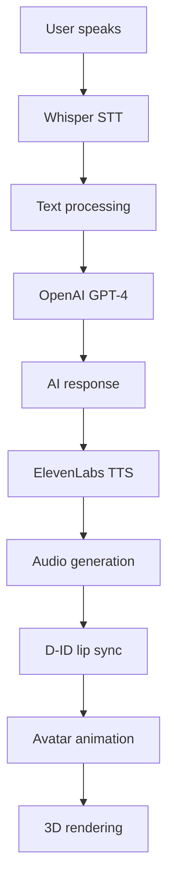
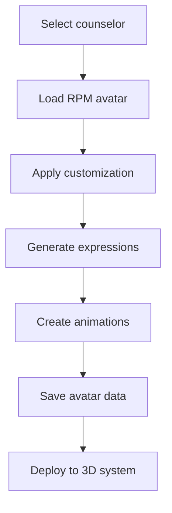
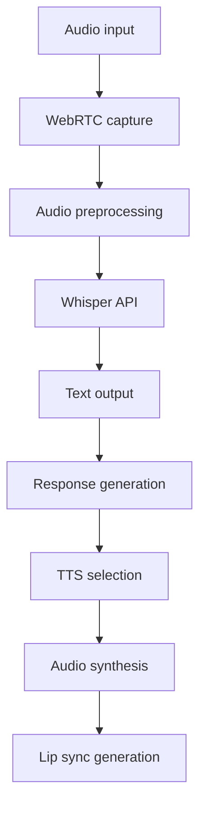

# CareConnect Avatar Development Stack

## Overview

CareConnect features a comprehensive avatar development stack that provides lifelike 3D avatars with voice interaction, lip sync, and emotional intelligence. The system integrates multiple cutting-edge technologies to create an immersive counseling experience.

## 🎭 Avatar System Architecture

### Core Components

1. **3D Avatar Rendering** - Three.js + Ready Player Me
2. **Voice Processing** - Whisper + ElevenLabs/PlayHT/Polly
3. **Lip Sync & Animation** - D-ID + Custom Viseme System
4. **Avatar Builder** - Ready Player Me Widget Integration
5. **Real-time Communication** - WebRTC + WebSocket

### Technology Stack

| Component | Technology | Purpose |
|-----------|------------|---------|
| **Frontend 3D** | Three.js | 3D avatar rendering and animation |
| **Avatar Builder** | Ready Player Me | Avatar creation and customization |
| **Voice Input** | OpenAI Whisper | Speech-to-text transcription |
| **Voice Output** | ElevenLabs/PlayHT/Polly | Text-to-speech synthesis |
| **Lip Sync** | D-ID + Custom | Facial animation and lip sync |
| **Backend** | Node.js/Express | API orchestration and data management |

## 🚀 Quick Start

### Prerequisites

- Node.js 18+ 
- npm or yarn
- Modern browser with WebGL support
- API keys for external services

### Installation

```bash
# Clone the repository
git clone <repository-url>
cd careconnect-avatar-system

# Install dependencies
npm install

# Set up environment variables
cp env.example .env
```

### Environment Variables

```bash
# OpenAI API (for Whisper STT)
OPENAI_API_KEY=your_openai_api_key

# ElevenLabs API (for TTS)
ELEVENLABS_API_KEY=your_elevenlabs_api_key

# PlayHT API (alternative TTS)
PLAYHT_API_KEY=your_playht_api_key
PLAYHT_USER_ID=your_playht_user_id

# Ready Player Me API
RPM_API_KEY=your_rpm_api_key
RPM_WEBHOOK_URL=https://your-domain.com/api/webhooks/rpm

# D-ID API (for lip sync)
DID_API_KEY=your_did_api_key

# AWS Polly (optional TTS)
AWS_ACCESS_KEY_ID=your_aws_access_key
AWS_SECRET_ACCESS_KEY=your_aws_secret_key
AWS_REGION=us-east-1
```

### Start Development Server

```bash
npm run dev
```

The server will start on `http://localhost:3000`

## 🎨 Avatar System Features

### 1. 3D Avatar Rendering

**File:** `public/js/avatar3d.js`

```javascript
// Initialize 3D avatar system
const avatarSystem = new Avatar3DSystem('avatar-container');

// Load counselor avatar
await avatarSystem.loadAvatar('dr-sarah-mitchell');

// Play animation
avatarSystem.playAnimation('listening');

// Update mood
avatarSystem.updateAvatarMood('supportive');
```

**Features:**
- Real-time 3D rendering with Three.js
- Dynamic lighting and shadows
- Smooth animations and transitions
- Responsive design
- WebGL optimization

### 2. Avatar Builder

**File:** `public/js/avatarBuilder.js`

```javascript
// Initialize avatar builder
const avatarBuilder = new AvatarBuilder('builder-container', {
    apiUrl: '/api/avatar',
    rpmApiUrl: '/api/rpm'
});

// Create counselor avatar
await avatarBuilder.createCounselorAvatar('dr-sarah-mitchell', 'Dr. Sarah Mitchell');
```

**Features:**
- Ready Player Me widget integration
- Real-time customization
- Multiple counselor styles
- Expression and mood controls
- Outfit and accessory selection

### 3. Voice Input/Output

**File:** `public/js/voiceInputOutput.js`

```javascript
// Initialize voice system
const voiceIO = new VoiceInputOutput({
    apiUrl: '/api/voice',
    language: 'en-US',
    continuousMode: true
});

// Start recording
await voiceIO.startRecording();

// Speak text
await voiceIO.speakWithElevenLabs('Hello, how can I help you today?', 'dr-sarah-mitchell');
```

**Features:**
- Real-time speech-to-text
- Multiple TTS providers
- Voice cloning support
- Audio streaming
- Noise cancellation

### 4. Lip Sync System

**File:** `services/lipSyncService.js`

```javascript
// Generate lip sync animation
const animationData = await lipSyncService.generateLipSyncAnimation(
    audioBuffer,
    avatarId,
    counselorId,
    'supportive'
);
```

**Features:**
- D-ID integration
- Custom viseme generation
- Real-time lip sync
- Expression mapping
- Audio analysis

## 🔧 API Endpoints

### Avatar Management

```bash
# Get counselor avatar
GET /api/avatar/counselor/:id

# Update avatar
PUT /api/avatar/:id

# Generate avatar with expression
POST /api/avatar/expression/:counselorId

# Get avatar with mood
GET /api/avatar/mood/:counselorId/:mood
```

### Ready Player Me Integration

```bash
# Get all counselor avatars
GET /api/rpm/avatars

# Create new avatar
POST /api/rpm/avatars

# Get avatar model (GLB)
GET /api/rpm/avatars/:id/model?format=glb

# Update avatar
PUT /api/rpm/avatars/:id

# Delete avatar
DELETE /api/rpm/avatars/:id
```

### Voice Processing

```bash
# Speech-to-text
POST /api/voice/transcribe

# Text-to-speech
POST /api/voice/synthesize

# Get available voices
GET /api/voice/voices/:provider

# Real-time streaming
POST /api/voice/stream
```

### Lip Sync

```bash
# Generate lip sync animation
POST /api/lipsync/generate

# D-ID lip sync
POST /api/lipsync/did

# RPM lip sync
POST /api/lipsync/rpm

# Real-time lip sync
POST /api/lipsync/realtime
```

## 🎯 Counselor Avatar Profiles

### Dr. Sarah Mitchell - Clinical Psychologist
- **Style:** Professional, warm, empathetic
- **Voice:** ElevenLabs Rachel (warm, professional)
- **Specialization:** Depression, anxiety, trauma
- **Avatar Features:** Glasses, business casual, caring expressions

### Michael Rodriguez - Substance Abuse Counselor
- **Style:** Supportive, calm, understanding
- **Voice:** ElevenLabs Domi (supportive, calm)
- **Specialization:** Addiction, recovery, family support
- **Avatar Features:** Casual professional, approachable demeanor

### Dr. Emily Chen - Marriage & Family Therapist
- **Style:** Gentle, compassionate, nurturing
- **Voice:** ElevenLabs Bella (compassionate, gentle)
- **Specialization:** Relationships, family dynamics, communication
- **Avatar Features:** Soft professional, necklace, warm expressions

### James Williams - Career & Life Coach
- **Style:** Confident, encouraging, motivational
- **Voice:** ElevenLabs Josh (confident, encouraging)
- **Specialization:** Career transitions, goal setting, personal development
- **Avatar Features:** Business attire, watch, confident expressions

### Dr. Maria Garcia - Crisis Intervention Specialist
- **Style:** Calm, reassuring, stabilizing
- **Voice:** ElevenLabs Adam (calm, reassuring)
- **Specialization:** Crisis management, emergency support, stabilization
- **Avatar Features:** Medical professional, stethoscope, calm expressions

### Lisa Thompson - Onboarding Specialist
- **Style:** Friendly, welcoming, informative
- **Voice:** ElevenLabs Sam (friendly, welcoming)
- **Specialization:** Platform introduction, user guidance, support
- **Avatar Features:** Welcoming attire, name tag, friendly expressions

## 🔄 System Flow

### 1. User Interaction Flow



### 2. Avatar Creation Flow



### 3. Voice Processing Flow



## 🛠️ Development Guide

### Adding a New Counselor

1. **Update Avatar Service:**
```javascript
// services/avatarService.js
const newCounselor = {
    'new-counselor-id': {
        style: 'avataaars',
        backgroundColor: 'f0f8ff',
        hair: 'long',
        hairColor: 'brown',
        accessories: ['glasses'],
        clothing: 'shirtCrewNeck',
        clothingColor: 'blue',
        eyes: 'happy',
        mouth: 'smile',
        skinColor: 'light'
    }
};
```

2. **Update Voice Service:**
```javascript
// services/voiceService.js
const newVoice = {
    'new-counselor-id': {
        elevenlabs: 'voice_id_here',
        playht: 'voice_url_here',
        polly: 'voice_name_here'
    }
};
```

3. **Create RPM Avatar:**
```javascript
// Create avatar using RPM service
const avatar = await rpmService.createCounselorAvatar('new-counselor-id', 'Counselor Name');
```

### Customizing Avatar Expressions

```javascript
// Add new expression
const newExpression = {
    'confident': { 
        smile: 0.7, 
        eyebrows: 'raised', 
        eyes: 'focused' 
    }
};

// Apply to avatar
avatarSystem.updateAvatarMood('confident');
```

### Extending Voice Providers

```javascript
// Add new TTS provider
async textToSpeechCustom(text, counselorId, options = {}) {
    // Implement custom TTS logic
    const response = await fetch('your-tts-api', {
        method: 'POST',
        body: JSON.stringify({ text, voice: counselorId })
    });
    
    return {
        success: true,
        audio: await response.arrayBuffer(),
        format: 'mp3',
        provider: 'custom'
    };
}
```

## 🧪 Testing

### Unit Tests

```bash
# Run avatar service tests
npm test services/avatarService.test.js

# Run voice service tests
npm test services/voiceService.test.js

# Run lip sync tests
npm test services/lipSyncService.test.js
```

### Integration Tests

```bash
# Test complete avatar flow
npm run test:integration

# Test voice processing
npm run test:voice

# Test 3D rendering
npm run test:3d
```

### Performance Tests

```bash
# Load testing
npm run test:load

# Memory usage
npm run test:memory

# Rendering performance
npm run test:performance
```

## 📊 Monitoring & Analytics

### Health Checks

```bash
# System health
GET /health

# Avatar system status
GET /api/avatar/status

# Voice system status
GET /api/voice/status

# RPM integration status
GET /api/rpm/status
```

### Metrics

- Avatar loading time
- Voice processing latency
- Lip sync accuracy
- 3D rendering FPS
- API response times
- Error rates

## 🔒 Security Considerations

### Data Protection

- All audio data is processed securely
- No persistent storage of sensitive conversations
- HIPAA-compliant data handling
- Encrypted API communications

### API Security

- Rate limiting on all endpoints
- API key validation
- CORS configuration
- Input sanitization

### Privacy Features

- Anonymous session IDs
- No personal data collection
- Secure audio streaming
- Temporary file cleanup

## 🚀 Deployment

### Production Setup

```bash
# Build for production
npm run build

# Start production server
npm start

# Environment variables
NODE_ENV=production
PORT=3000
```

### Docker Deployment

```dockerfile
FROM node:18-alpine
WORKDIR /app
COPY package*.json ./
RUN npm ci --only=production
COPY . .
EXPOSE 3000
CMD ["npm", "start"]
```

### Cloud Deployment

- **AWS:** ECS with Fargate
- **Google Cloud:** Cloud Run
- **Azure:** Container Instances
- **Vercel:** Serverless functions

## 🔮 Future Enhancements

### Planned Features

1. **Advanced AI Emotions**
   - Real-time emotion detection
   - Adaptive responses
   - Mood-based avatar changes

2. **Multi-language Support**
   - International voice models
   - Cultural avatar variations
   - Translation services

3. **AR/VR Integration**
   - VR headset support
   - AR mobile experience
   - Spatial audio

4. **Advanced Animations**
   - Procedural animations
   - Physics-based movements
   - Gesture recognition

5. **Voice Cloning**
   - Custom voice training
   - Personalized avatars
   - Voice preservation

### Technology Roadmap

- **Q1 2024:** Enhanced lip sync accuracy
- **Q2 2024:** Real-time emotion detection
- **Q3 2024:** VR/AR support
- **Q4 2024:** Advanced AI integration

## 📞 Support

### Documentation

- [API Reference](./API_REFERENCE.md)
- [Troubleshooting Guide](./TROUBLESHOOTING.md)
- [Performance Optimization](./PERFORMANCE.md)

### Contact

- **Technical Support:** tech@careconnect.com
- **API Support:** api@careconnect.com
- **Emergency:** 702-664-0009

### Community

- **GitHub Issues:** [Report bugs](https://github.com/careconnect/issues)
- **Discord:** [Join community](https://discord.gg/careconnect)
- **Documentation:** [Read docs](https://docs.careconnect.com)

---

**CareConnect Avatar Development Stack** - Building the future of AI-powered mental health support with lifelike 3D avatars and advanced voice technology. 